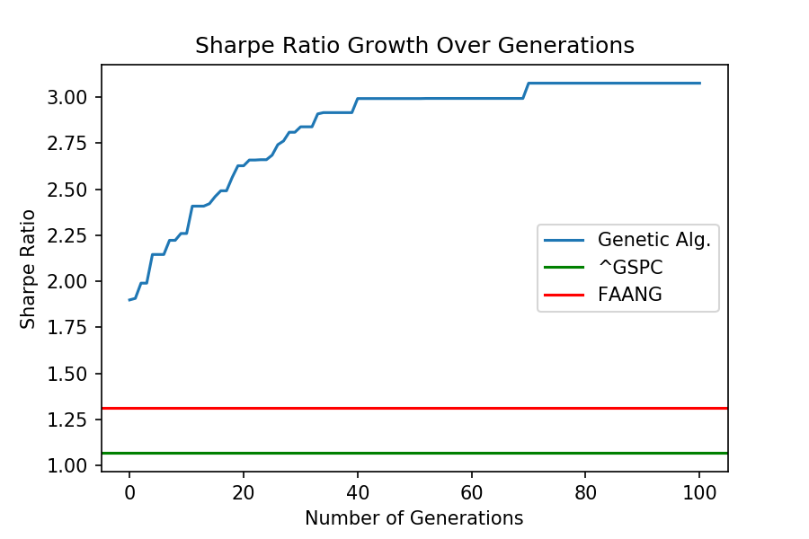
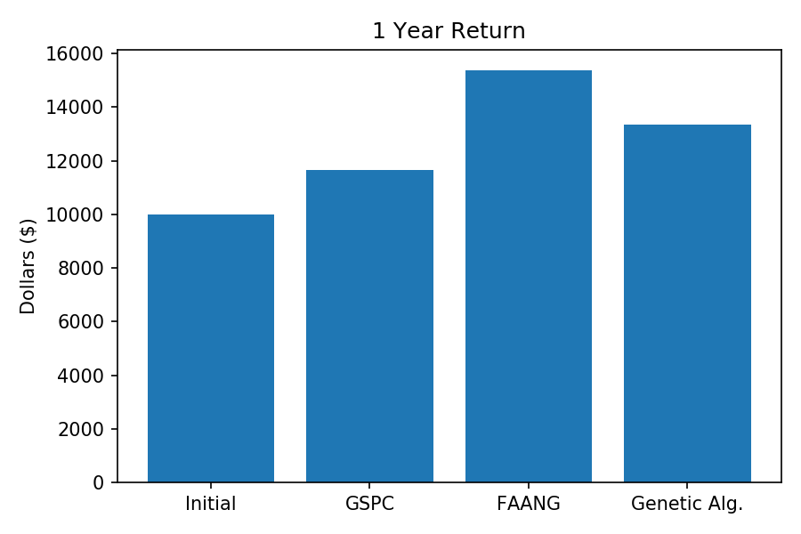

# GeneticAlgStockPf
Genetic algorithm for stock portfolio optimization.

In this instance the algorithm in generating portfolios from stock data taken from Yahoo! finance using the python library yfinance. It meaures the fitness of each portfolio using the shrape ratio and then the best portfolios have children. This involves mixing parts of the parent portfolios to generate children portfolios.

I compared the sharpe ratios from the genetic algorithm to ^GSPC, the S&P 500 index, and FAANG. The graph below shows the algorithms results over the generations.

As seen in the graph above, the algorithm does a decent jobs of finding a portfoilo with a high sharpe ratio, however, sharpe ratios are not the best metric to, at least, soley judge stock performance. This can be seen by the graph below where I calculate the money I would have made if I had invested $10,000.00 in the chosen portfolios.

While the stocks picked by the genetic algorithm do better than than the S&P 500 index, FAANG outpreforms it. I think with a better fitness metric it could have better results, although this could be useful as a place to start looking for good stocks.
